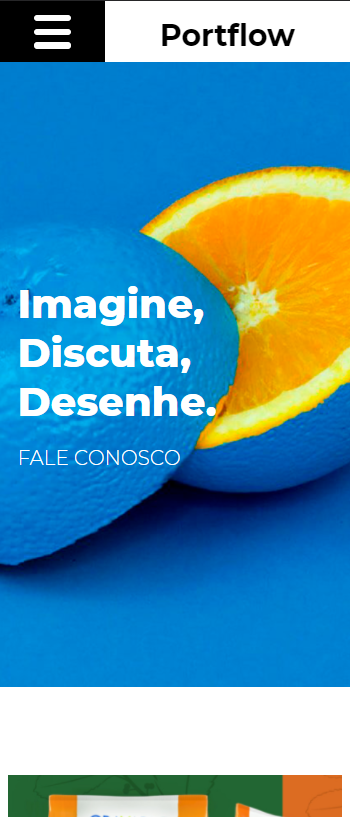

### Portflow project
 
<h5>🗒️ DESCRIPTION</h5>

A responsive landing page for educational purpose.

 
<h5>🕐 PROJECT STATUS</h5>
<!-- ☑️ -->

⬛ on going

☑️ finished

⬛ needs some bug fix

⬛ paused

 
<h5>🌐 LINK TO WEBPAGE</h5>

https://thfarina.github.io/Portflow/

 
<h5>🎨 DESIGN REFERENCE</h5>

https://xd.adobe.com/view/13ead2e1-3ac9-44a1-b4cb-14736da07bb0-46b9/specs/

 
<h5>🖼️ SCREENSHOT</h5>

